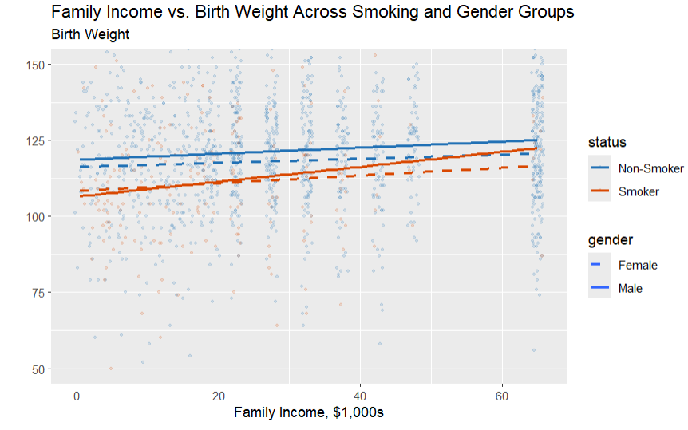

## The Data

For this lab, we will be using the Wooldridge bwght dataset. It is a cross-sectional dataset often used in introductory econometrics to study how family, parental, and pregnancy-related factors are associated with infant birth weight. The dataset contains 1388 observations and 14 variables. Each observation represents one child, with information on its birth weight. Additionally, each observation has data on family information that could contribute to the baby's birth weight, including income, parental education, birth order, sex, race, and the number of cigarettes smoked a day by the mother.

The data is in a .RData so it is easy to access. The data includes a data frame named `data`, which contains the information described above. It also includes a data frame named `desc`, which serves as a brief data dictionary.


The full data dictionary for this dataset can be accessed here: [Data Dictionary](https://justinmshea.github.io/wooldridge/reference/bwght.html)


### Question 0: Data & Package Loading
```{r}
# Data
load("bwght.RData")
```
```{r}
# Packages
library(tidyverse)
library(knitr)
library(gt)
```


### Question 1: Data Cleansing

**Using relevant dplyr verbs in a single pipeline, do the following: 1) create a new variable reflecting the affordability relationship between family income and state cigarette prices, 2) remove `lbwght`, `bwghtlbs`, `packs`, and `lfaminc` from the dataset, 3) create a new variable fam_educ which is the sum of the mother's and father's education**
```{r}
data <- data |>
  mutate(affordability = faminc / cigprice) |> 
  select(faminc: cigs) |>
  mutate(fam_educ = motheduc + fatheduc)
```

### Question 2: Factor and Dummy Variable Creation Using case_when()

**Create a new factor variable `cig_level`, which reflects the the number of cigarettes smoked by the mother. 0 is "none", 1-3 is "low", 4-10 is "moderate", 11-20 is "high", and 21+ is "very high. Additionally, create a dummy variable called `treat`. This will be 0 if the mother doesn't smoke and 1 if the mother does smoke. Do this in one pipeline."**

```{r}
data <- data |>
  mutate(cig_level = factor(case_when(cigs == 0 ~ "zero",
                               cigs <= 3 ~ "low",
                               cigs <= 10 ~ "moderate",
                               cigs <= 20 ~ "high",
                               .default = "very high")),
         treat = case_when(cigs == 0 ~ 0,
                           .default = 1))
```


### Question 3: Table Creation 
**Create a table that shows, for each level of `cig_level`, a count of individuals and the average `bwght`, `motheduc`, `fatheduc`, and `cigprice`. Order the table from highest to lowest `bwght`**

```{r}
data |>
  group_by(cig_level) |>
  summarize(n(),
            av_bwght = mean(bwght, na.rm = TRUE),
            av_motheduc = mean(motheduc, na.rm = TRUE),
            av_fatheduc = mean(fatheduc, na.rm = TRUE),
            av_cigprice = mean(cigprice, na.rm = TRUE)) |>
  arrange(desc(av_bwght))
```

### Question 4: Table Formatting

**Nicely format the table using `gt` or `kable()` and `kableExtra`**

Your table should include:

- Nice column names
- A nice title
- Numbers rounded to 2 decimal points
- A $ sign in front of the price in `av_cigprice`

```{r}
data |>
  group_by(cig_level) |>
  summarize(n(),
            av_bwght = mean(bwght, na.rm = TRUE),
            av_motheduc = mean(motheduc, na.rm = TRUE),
            av_fatheduc = mean(fatheduc, na.rm = TRUE),
            av_cigprice = mean(cigprice, na.rm = TRUE)) |>
  arrange(desc(av_bwght)) |>
  gt() |>
  tab_header(
    title = md("**Average Family Demographics and Baby Birthweight by Number of Cigarettes Smoked While Pregnant**")
  ) |>
  cols_label(
    "n()" = "Number of Individuals"
    "cig_level" = "Cigarattes Smoked Per Day",
    "av_bwght" = "Birth Weight",
    "av_motheduc" = "Mother's Years of Education",
    "av_fatheduc" = "Father's Years of Education",
    "av_cigprice" = "Price of Cigarette"
  ) |>
  fmt_currency(
    columns = av_cigprice,
    currency = "USD",
    decimals = 2
  ) |>
  fmt_number(columns = c(av_bwght, cig_level, av_motheduc, av_fatheduc, av_cigprice),
             decimals = 2)
```


### Question 5: lm function

**Use the `lm()` function in R to create a linear model for the effect of the mother smoking cigarettes, `cigs` on the birth weight of the baby in ounces, `bwght`. Create another linear model that adds controls for `faminc`, `fatheduc`, `motheduc`, `parity`, `male`, `white`.**

```{r}
lm(bwght ~ cigs,
   data = data)
lm(bwght ~ cigs + faminc + fatheduc + motheduc + parity + male + white,
   data = data)
```

### Question 6: Function Writing and Subsetting Data

**Write a function `estimate_att` that takes a linear model and a data frame as the input and returns the estimated treatment effect for the treated population (ATT).** This will take a couple steps. The ATT is the average effect for individuals who receive treatment. In this scenario, the treatment is smoking cigarettes. For more information on the ATT and the application of this question, check out this [resource]("ATT_Explanation.pdf")


**6a. Copy the second linear model you made in question 5 to the code chunk below. Change the code so that the data referenced is a subset of the with only mothers that do not smoke. Also delete `cigs` from the regression. Store this model into a variable This variable will be the input for the function you write in step 6b**

```{r}
mod <- lm(bwght ~ faminc + fatheduc + motheduc + parity + male + white,
   data = data[data$treat == 0,])
```


**6b. Write the function to predict the ATT, as described in 6. The linear model the function takes as an argument will already be created from step 6a.**

Steps:

1. Use the model from the function input to predict the potential result of not smoking on `bwght` for the entire population.
2. Subtract the actual results (`bwght`) from the prediction. 
3. Add the results of step 3 to a new column in the data set called `ITE`. 
4. Calculate the mean of the `ITE` column for individuals with `treat` equal to one This is the value we want to return.

::: callout-tip
You will want to check out the `predict()` function to help with step 1.
:::

```{r}
estimate_att <- function(model, df) {
  # Step 1
  prediction <- predict(model, newdata = df)
  # Step 2 and 3
  df$ITE <- df$bwght - prediction
  # Step 4
  mean(df$ITE[df$treat == 1], na.rm = TRUE)
}
  
```

**6c. Test estimate_att() out on the data using the model from part a.**

```{r}
estimate_att(mod, data)
```


### Question 7: ggplot & Data Ethics



**Recreate something similar to the above graph showing the relationship of `bwght` and `faminc` across the different levels of `treat` and `male` (i.e., whether the mother smoked during pregnancy and whether the child was male or female). Then, discuss what you observe. Is there one combination of `treat` and `male` levels that appears to particularly strengthen the relationship between `faminc` and `bwght`? Then consider the data ethics concerns present in such a question. Should we make these sort of generalized statements with data? What do we not know about this dataset that we might want to learn before making any sort of general inference about the population?**

```{r}

data |>
  mutate(
    status = factor(treat, levels = c(0,1), labels = c("Non-Smoker", "Smoker")),
    gender = factor(male, levels = c(0,1), labels = c("Female", "Male"))
  ) |>
  ggplot(aes(x = faminc, y = bwght,
             color = status,
             linetype = gender)) +
  geom_jitter(alpha = 0.15, size = 0.8, width = 0.8, height = 0) +
  geom_smooth(method = lm, se = FALSE, linewidth = 1.1) +
  scale_color_manual(values = c("Non-Smoker" = "#2171b5", "Smoker" = "#d94801")) +
  scale_linetype_manual(values = c("Female" = "dashed", "Male" = "solid")) +
  labs(title = "Family Income vs. Birth Weight Across Smoking and Gender Groups",
       x = "Family Income, $1,000s",
       y = "",
       subtitle = "Birth Weight") +
  coord_cartesian(ylim = c(50, 150))
           
```


### Question 8: MR plot creation

**Explore the relationship between family income, cigarettes smoked during pregnancy, and child birth weight. To do this, create a multiple regression model with two explanatory variables (`cigs` and `faminc`) and one response variable (`bwght`). Your final submission should include your code and a tidy summary of the model. Once you have these, assess how good your model is at predicting a child's birth weight. Support your answer.**

This model is not very good at predicting a child's birth weight. Its adjusted R-squared is only 0.0284. That is, adjusting for the number of predictors in the model (as R-squared always increases with added predictors), only 2.84 percent of the total variation in the data is explained by our model.

:::callout-tip
Don't overthink the creation of the regression model object, but feel free to check the documentation of the lm() function.
:::

```{r}

MR_model <- lm(bwght ~ faminc + cigs,
               data = data)
summary(MR_model)

```


### Question 9: Inference Using Model Validation

**For this question, we are interested in the difference between the `bwght` of children whose mother did smoke and the `bwght` of children whose mother did not smoke. Specifically, we want to investigate the relative normality of each subset of data. State your conclusions from an examinations of both plots. You may want to discuss the following, along with more general conckusions about the effects of smoking on `bwght`: does either subset of the data appear to be normally distributed? Is one more closely adherent to the normal distribution than the other? Why might that be? Is it possible that other lifestyle factors influencing `bwght` differ more among one group than the other (hint: look at your created table above and think about the differences in other lifestyle facts)?**

::: callout-tip
To compare relative normality, you'll need to use q-q plots. Look at the documentation for those ggplot geoms for help!
:::
```{r}
# generating both q-q plots

data |>
  mutate(treat = factor(treat, labels = c("Non-smoker", "Smoker"))) |>
  ggplot(aes(sample = bwght)) +
  geom_qq(color = "blue") +
  geom_qq_line() +
  facet_wrap(~ treat) +
  labs(x = "Birth Weight", y = "")

```

